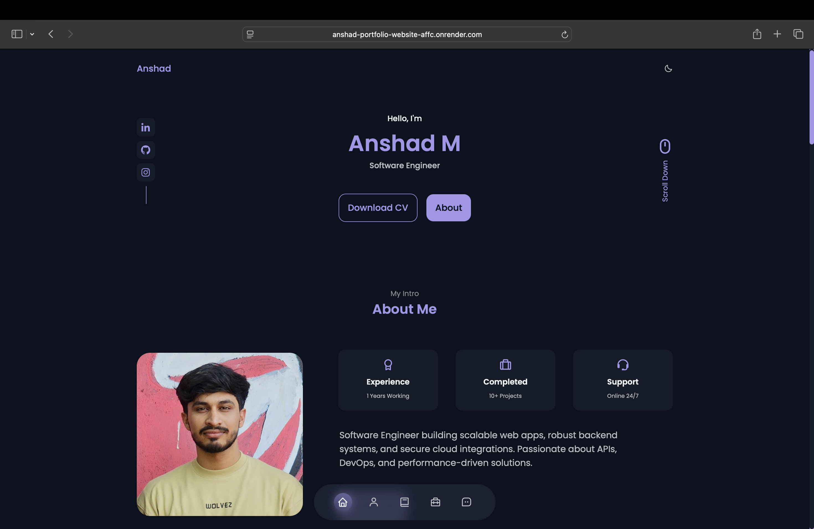
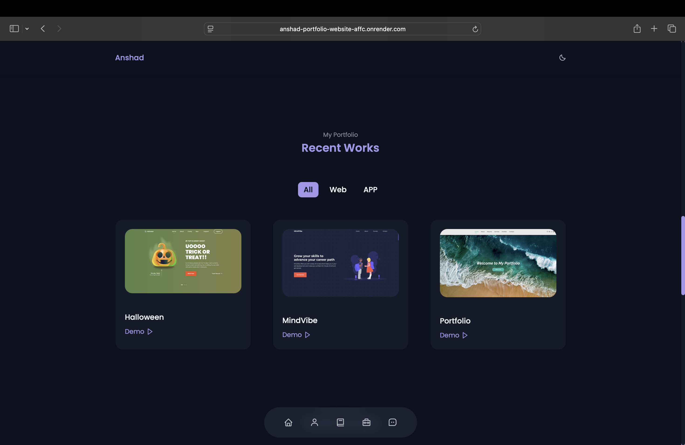
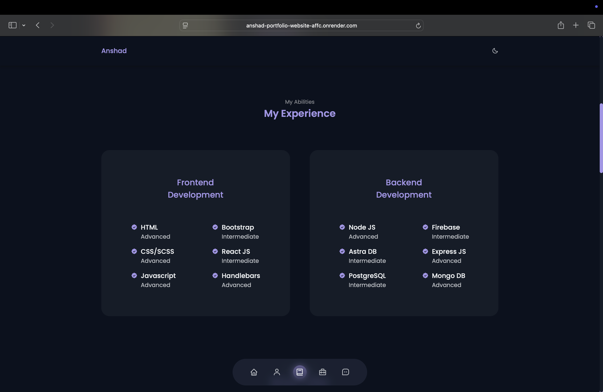
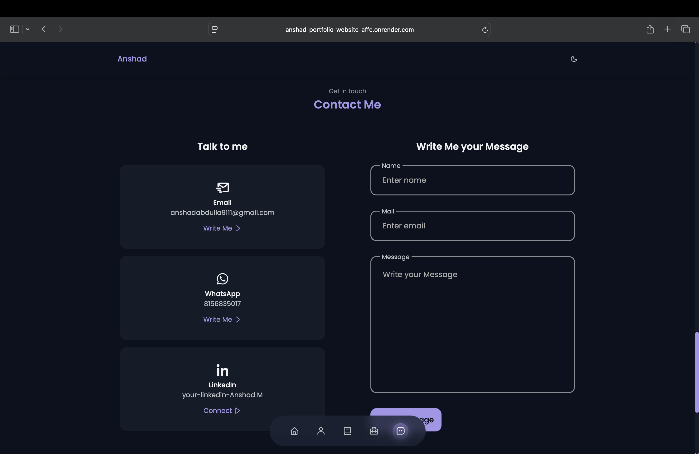

# 🌐 Anshad Portfolio Website

A personal portfolio website built using **Node.js**, **Express.js**, and **Handlebars (HBS)**. This site is designed to showcase my projects, technical skills, and provide a way for others to contact me professionally.

## 🚀 Features

- ✨ Dynamic pages using Handlebars templating engine
- 📂 Projects section with brief descriptions and links
- 🧠 Skills and technology stack
- 📞 Contact form with email functionality
- 📱 Fully responsive design
- 🌐 Deployed on [https://anshad-portfolio-website-affc.onrender.com]

---

## 🛠️ Tech Stack

- **Backend**: Node.js, Express.js
- **Templating Engine**: Handlebars (HBS)
- **Frontend**: HTML5, CSS3, JavaScript
- **Deployment**: Render

---

## 📸 Screenshots

### 🏠 ABOUT Section


### 💼 WORK Section


### 💼 SKILLS Section


### 💼 CONTACT Section


---

## 🧰 Setup Instructions

### 1. Clone the Repository

```bash
git clone https://github.com/anshadm/Anshad-portfolio-website.git
cd Anshad-portfolio-website
